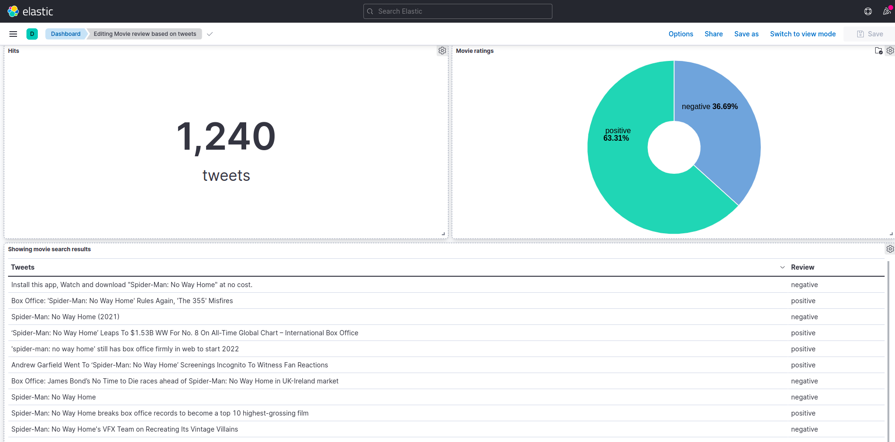
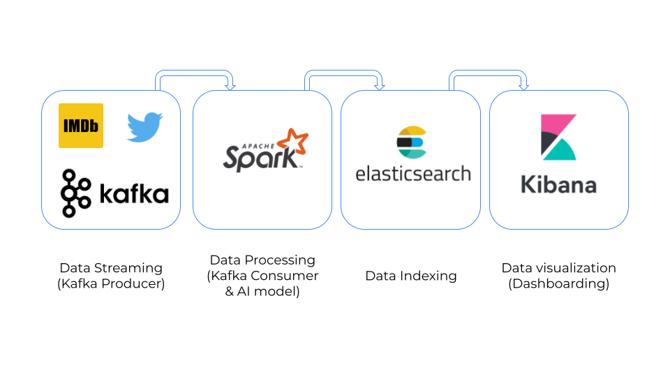

<h1 align="center">
  <br>

    Twitter Movie Reviews Analysis

</h1>

<div align="center">
  <h3>
    <a href="#Overview">Overview</a> |
    <a href="#Prerequisites">Prerequisites</a> |
    <a href="#How to run">How to run</a> |
    <a href="#Data preprocessing">Data preprocessing</a> |
    <a href="#Spark ML pipeline">Spark ML pipeline</a> 
  </h3>
</div>

<br>

## Overview
This project consists of a Kibana dashboard for sentiment analysis of movie reviews scrapped from twitter.
The project sets up a complete pipeline for data collection, streaming, ML model training and prediction, indexing and visualization.




## Prerequisites

In order to be able to reproduce this project, the following software should be installed:
- Spark (spark-3.1.1-bin-hadoop2.7)
- Kafka (kafka_2.13-2.7.0)
- ElasticSearch (elasticsearch-7.14.2)
- Kibana (kibana-7.14.2)

Also, you must have valid twitter API credentials.


## How to run
### Start required services
Here $PATH stands for the directory where each of the required services is installed.

1. Start ElasticSearch
``` shell
cd $PATH
./bin/elasticSearch
```
2. Start Kibana
``` shell
cd $PATH
./bin/kibana
```

3. start zookeeper
``` shell
cd $PATH
bin/zookeeper-server-start.sh config/zookeeper.properties
```
4. start kafka
``` shell
bin/kafka-server-start.sh config/server.properties
```

### Execute python files

1. install requirements
```shell
pip install -r requirements.txt
```
1. producer.py  (to launch search and tweet extraction)
``` shell
python3 producer.py --movie_title="movie title" --twitter_consumer_key="your twitter consumer key" --twitter_consumer_secret="your twitter consumer secret" --twitter_access_token="your twitter access token" --twitter_access_token_secret="your twitter access token secret"
```

2. Submit training (train spark model)
``` shell
cd PATH_TO_SPARK
./bin/spark-submit --packages org.apache.spark:spark-sql-kafka-0-10_2.12:3.1.1,org.elasticsearch:elasticsearch-spark-30_2.12:7.14.2 PROJECT_DIRECTORY/training.py --dataset=PROJECT_DIRECTORY/movies.csv
```
3. Submit consumer (prediction and pushing to elascticSearch)
``` shell
cd PATH_TO_SPARK
./bin/spark-submit --packages org.apache.spark:spark-sql-kafka-0-10_2.12:3.1.1,org.elasticsearch:elasticsearch-spark-30_2.12:7.14.2 PROJECT_DIRECTORY/consumer.py
```
### Launch dashboard
1. Open http://localhost:5601/ in your browser.
2. Go to Management>Kibana>Saved Objects
3. Import [dashboard.ndjson](kibana/dashboard.ndjson)
4. Open dashboard

## Data preprocessing
Before performing sentiment analysis, the scrapped tweets undergo a cleaning process:
- Filter out retweets, mentions and hashtags.
- Filter out tweets containing only movie name.
- Remove links, emojis and irrelevant tags.
- Keep only tweets written in english.

## Spark ML pipeline
The Spark ML pipeline consists of 5 stages
1. Tokenizer
2. Stop words remover
3. Hashing TF
4. IDF
5. Logistic regression model

The model is then trained on a [dataset](dataset/movies.csv) containing tweets from IMDb and rotten tomatoes and classified to positive or negative.
